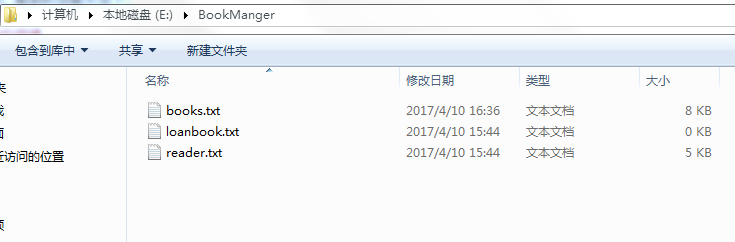
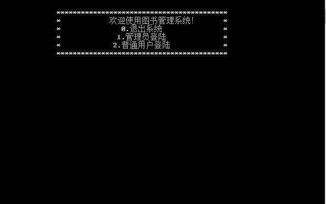
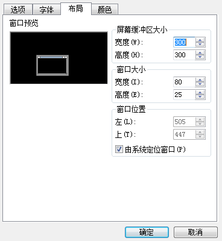
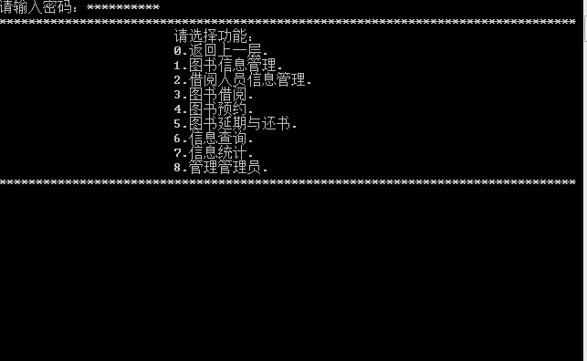
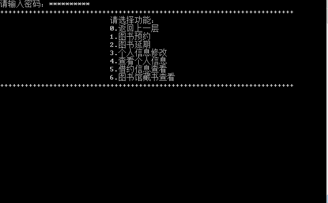

BookManager
-----	

我的博客：[并非菜鸟](https://songyaxu.github.io)
=====
## 介绍
>	
**BookManager(图书管理系统)**这个系统是我在刚开始自上大学的时候写的，那个时候刚开始学习编程，对语言了解的很少，然后自己在学习了一个学期的C++之后写的。这时候看了看，觉得自己当时还是很强的。能写出这么多东西，也是很崇拜自己的。再多的话就不说了。

## 系统的搭建
>
这个系统很简单，只有一个__1.cpp__的文件，然后有3个文件：
>
+ books.txt
+ loanbook.txt
+ reader.txt
>
这三个文件分别是用来存储图书（book.txt）、图书借阅关系(loanbook.txt)、和系统中的人员信息(reader.txt)。
>
只需将三个文件放在指定的位置就可以了。代码里的位置是

## 系统使用
>
当时自己也是初学者，现在想想，应该将这个变量定义成一个字符串常量方便改动！
然后运行代码后的主界面是这样的

>
在运行前最好将命令行的布局中的屏幕缓存区设置的大一点这样方便查看图书和用户信息。
>

>
我们可以通过查看**reader.txt**来查看管理员账号和读者账号。
我们可以看出，我们所有的数据都是使用txt文本文件来存储的，所以这需要对文件内的文本的格式有着极大的要求。
然后我们可以通过设定好的账号登录
>
管理员主页:
>

>
用户主页:
>

>
我们可以看到功能还是很强大的！
## 总结
>
其实从现在角度来看这个代码，还是很佩服当初的自己，当时只学了一年的C++，然后就写出了**3250**行的代码。
其中有很多代码其实都是为了增加代码的容错率，比如输入用户不存在，怎么提示，密码不存在怎么提示。输入错误怎么提示。很多很多。
但是也有许多的不足。也许其中还有很多**BUG**。希望看到的、或者需要这个代码的小伙伴能够读懂我写的代码，然后把它改的更好！
有问题可以联系我哦！